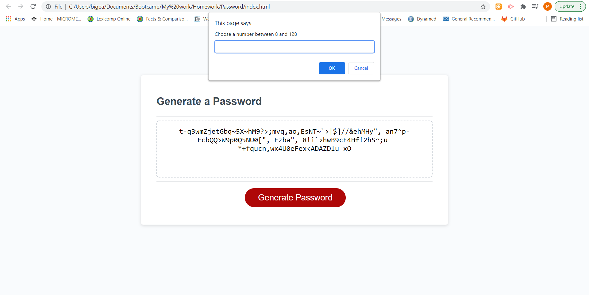

# Password Generator

In order to connect with my html, I used a combination of variables, funtions, arrays, promts, for loops, if statements, and query selectors. These were all to display the correct parameters for my password generator (correct numbers, letters, and special characters), as specified by the user's preference. The user can generate a very strong password between 8 and 128 characters, given the options to select from for their designated password.

Screenshot: 

Link to repository: https://swooshgawd.github.io/Password/

